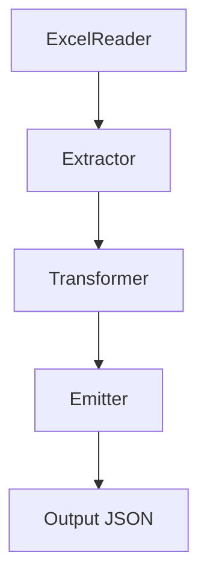
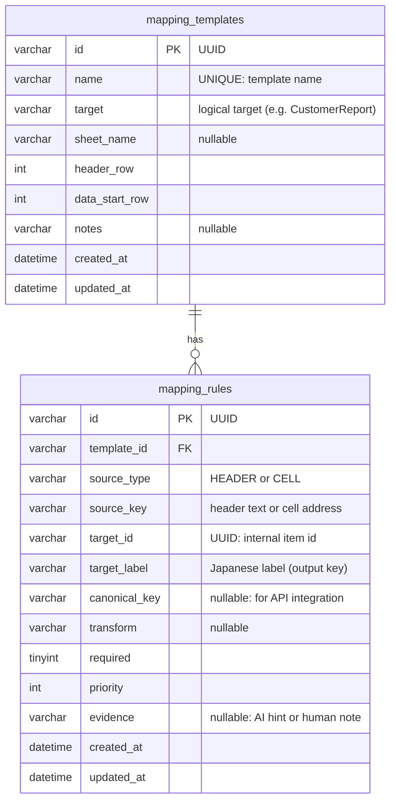

# excel-template-mapper

## これは何？

`excel-template-mapper` は、**帳票形式（紙っぽいExcel）を JSON（構造化データ）に落とし込むための基盤**を作る PoC です。

本プロジェクトが最初に解決したい現場課題は、次の一点です。

- **紙Excelを JSON 化して、grep / 正規表現 / 目視で扱えるようにしたい**

そのため、本PoCでは **日本語キー（ラベル）でのJSON出力**をデフォルトとします。

---

## 本PoCの主目的

本PoCの主目的は **「帳票形式の紙Excelを、正規表現・検索しやすいJSON（日本語キー）へ落とし込む」** ことです。

- デフォルト出力：**日本語キー（label）JSON**  
  → 調査・監査・運用でそのまま扱えることを重視

- オプション：**AIによる英数字キー生成（canonical_key）**  
  → 将来のAPI連携やスキーマ固定が必要になった場合に追加できる拡張として扱う

> NOTE: 本PoCでは「AI推論」は実装しません。  
> ただし、AIが生成した推論結果をテンプレートとして保存できる **データモデル** と、テンプレを使って変換できる **変換パイプライン** を先に作ります。

---

## なぜ必要？

帳票形式の紙Excelは、次のような特徴があり、取り込みが難しくなりがちです。

- セル結合がある
- 「ラベルの隣が値」とは限らない（値の位置が不規則）
- レイアウトが部署・時期で微妙に変わる
- それでも最終的には構造化（JSON/DB/API）したい

この揺れを毎回コードで吸収すると、実装が増え、修正が辛くなり、属人化します。  
そこで「揺れ」を **テンプレート（設定）** に逃がし、変換処理を再利用できるようにします。

---

## PoCで検証したいこと（評価軸）

PoCのゴールは「動いた」ではなく、現実的な制約の中で次が判断できる状態にすることです。

- **不規則度の許容範囲**：どの程度までレイアウトが崩れても対応できるか
- **推論（将来AI）の射程**：どこまでを推論でフォローできそうか／できなさそうか
- **人手の削減効果**：目視確認や手直しの負担が、最終的にどれだけ減りそうか

本PoCでは、表形式 →（段階的に不規則性を上げる）という順で検証し、  
「この条件なら現実的」「ここから先は追加コストが必要」を結論としてまとめます。

---

## 全体像

### PoC（表形式で基盤を作る）

本PoCは「技術探索を増やさずに実装できる範囲」で、まず **表形式（ヘッダ＋データ行）** を対象にして、

- テンプレート保存（MySQL）
- マッピング再利用
- Excel → JSON の変換パイプライン

を成立させます（GitHub上で「設計」と「動くもの」を示すことを重視）。


### 将来拡張（帳票形式を推論でテンプレ化）

帳票形式（セル結合・不規則レイアウト）は、汎用的に解くには推論が有効です。  
本プロジェクトでは、**推論の結果（候補）をテンプレートとして保存し**、次回以降はテンプレで自動変換する流れを想定します。


---

## 入力と出力の例（イメージ）

### 入力（表形式Excelの例）

例：ヘッダに次のような列があるケース（列順は変わり得る）

- `カスタマID`
- `確定予定日`
- `提出日`
- `精査結果`

（実務イメージ：B列=カスタマID、C列=確定予定日、O列=提出日、R列=精査結果 など）

### 出力（JSONの例：日本語キー）

```json
[
  {
    "カスタマID": "A001",
    "確定予定日": "2026-01-03",
    "提出日": "2026-01-04",
    "精査結果": "完了"
  },
  {
    "カスタマID": "A002",
    "確定予定日": "2026-01-05",
    "提出日": null,
    "精査結果": "確認中"
  }
]
```

---

## コアコンセプト

### Template（テンプレート）

Excel ファイルの **構造的な前提** を表します。

- 対象シート名（任意）
- ヘッダ行番号
- データ開始行番号
- 出力したい論理構造（例：`CustomerReport`）

テンプレートは「このExcelはこういう形」という前提情報です。

### Mapping Rule（マッピングルール）

Excel のどの値を、どの項目へ割り当てるかを定義します。

- 表形式向け：ヘッダ名から列を特定（HEADER）
- 帳票形式向け：値セルを直接指定（CELL）
- 必須項目かどうか（required）
- 変換方法（transform：日付パース等）
- 推論の根拠情報（将来AIが出した候補を保存）

---

## 処理設計（変更に強い理由）

処理は「値の取り出し」「変換」「出力」の責務に分割し、差し替え可能にします。



- **Extractor**：値の取り出し方を切り替え（HEADER / CELL）
- **Transformer**：最小実装から拡張可能（noop / trim / date 等）
- **Emitter**：PoCは JSON 出力（デフォルトは日本語キー）

---

## データモデル（MySQL）

このPoCのキモは、**マッピング定義（テンプレート）をDBに保存して再利用できること**です。  
さらに将来、推論（AI等）で生成された候補も同じ形で保存できるようにします。

### ER図



---

## 各カラムの意味（なぜ持つのか）

### mapping_templates

- `id`（UUID）  
  テンプレートの識別子（文字列UUID）。環境移行やデータ移送を想定して扱いやすい形にします。

- `name`（UNIQUE）  
  人が選ぶテンプレ名。例：`reporting_v1`。

- `target`  
  出力の論理名（Go構造体名など）。PoCでは文字列として扱い、実装側でフィールド定義に紐づける想定。

- `sheet_name`（nullable）  
  対象シートが固定なら指定。変わる／単一なら null でも良い。

- `header_row`  
  ヘッダがある行番号（タイトル行があるExcelに対応）。

- `data_start_row`  
  データ開始行番号（空行・注意書きが挟まるExcelに対応）。

- `notes`（nullable）  
  説明メモ（運用や引き継ぎで効く）。

### mapping_rules

- `id`（UUID）  
  ルールの識別子。

- `template_id`  
  所属テンプレート。

- `source_type`  
  値の取り方。
  - `HEADER`：ヘッダ名から列を特定して各行の値を取る（表形式向け・列順変更に強い）
  - `CELL`：特定セル番地から値を取る（帳票形式向け）

- `source_key`  
  `source_type` に応じた指定値。
  - `HEADER`：ヘッダ文字列（例：`カスタマID`）
  - `CELL`：セル番地（例：`E17`）

  > PoCではカラムを最小化して扱いを単純にするため、1カラムにまとめています。

- `target_id`（UUID）  
  出力項目の内部識別子（英数字に依存しない安定ID）。  
  将来、項目名の揺れや同義語を吸収する基盤になります。

- `target_label`  
  出力JSONのキーとして使う **日本語ラベル**（本PoCのデフォルト）。  
  正規表現・検索・目視用途で扱いやすいことを重視。

- `canonical_key`（nullable）  
  API連携やスキーマ固定が必要になった場合の **英数字キー**（オプション）。  
  本PoCでは必須とせず、将来の拡張として扱います。

- `transform`（nullable）  
  変換指定。例：
  - `trim`
  - `date:2006-01-02`

- `required`  
  必須項目かどうか。必須が欠けた場合の挙動（エラー／警告）を制御できる。

- `priority`  
  同じ `target_id` に複数候補がある場合の優先度。  
  将来、列名揺れや複数候補を扱うときに役立つ（PoCでは固定値でもOK）。

- `evidence`（nullable）  
  ルールの根拠メモ。将来AI推論で「なぜこの候補か」を保存したり、人間が注釈を残す用途。

---

## 出力キーについて（日本語キーがデフォルト）

本PoCのデフォルト出力は **日本語キー（target_label）** です。

- 正規表現での検索
- grep / jq 等での調査
- 人間の目視

を最優先にしています。

将来、外部API連携などで安定した英数字キーが必要になった場合は、  
`canonical_key` を用いた出力モードを追加できる設計とします。

---

## Non-goals（本PoCで扱わないこと）

- AI推論ロジックの実装（将来拡張）
- Web UI
- 複雑な変換DSL
- 大規模バッチ最適化

---

## 今後の拡張案

- 帳票形式（セル結合／不規則レイアウト）に対する推論（AI）
- 推論結果の候補提示と、ユーザーによる確認・修正フロー
- テンプレート自動判定（ヘッダ集合／特徴量）
- 英数字キー（canonical_key）生成のキャッシュ（同一ラベルは再問い合わせしない）
- 1つのExcel内に複数のデータ領域（ヘッダ情報ブロック／明細テーブル／備考など）があるケースへの対応  
  - 抽出範囲（矩形/名前付き範囲）の指定  
  - 範囲ごとの出力先（別JSON / ネスト構造）
- 出力先の拡張（DB / API 送信）
